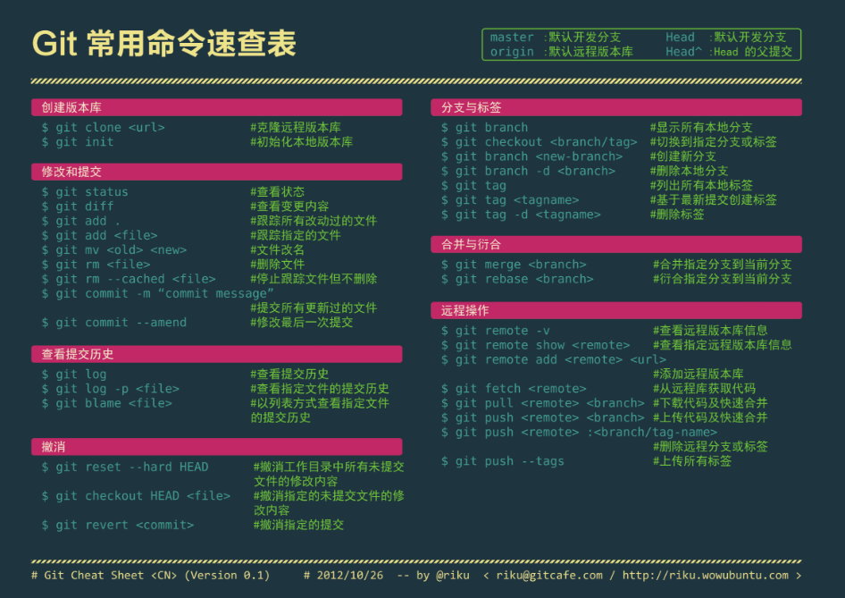

# git常用命令

## 设置当前项目账户

```bash
   git config user.name "your Name" # 设置用户名
   git config user.email "gitee@xx.com" # 设置邮箱
   git config --list # 查看当前项目配置
```

## 提交文件

1. git status
2. git add 文件夹/文件
3. git commit -m "注释"
4. git pull（如果冲突需要处理完冲突）
5. git diff (比较文件)
6. git push

## 分支

1. git branch 分支名（新建分支）
2. git branch -d 分支名（删除分支）
3. git checkout 分支名（切换分支）
4. git branch （查看本地的所有分支）
5. git branch -a（查看本地和远程仓库的所有分支）
6. git branch -r（查看远程仓库的所有分支）
7. git branch -v（查看每一个分支的最后一次提交）
8. git fetch（将本地分支与远程保持同步）
9. git fetch --all（将本地所有分支与远程保持同步）
10. git pull --all（拉取所有分支代码）
11. git merge master 分支名（合并分支）

## 查看提交信息

[git命令log与reflog的比较](https://blog.csdn.net/u013252047/article/details/80230781)

1. git log（会按提交时间显示所有提交过的版本信息）[详情](https://www.jianshu.com/p/0805b5d5d893)
2. git reflog（查看所有分支的所有操作记录，包括已经被删除的 commit 记录和 reset 的操作）

## 回退代码

1. git reflog（查看想要回退到哪一步）
2. git reset --soft HEAD^ 或者 git reset --hard HEAD~1（回退一步）

## 问题案例

* [Git HEAD detached from XXX (git HEAD 游离) 解决办法](https://blog.csdn.net/u011240877/article/details/76273335)

* [git提交到HEAD detached导致代码丢失](https://www.jianshu.com/p/f247a27851fb)

## 使用技巧

* git log（q:退出，wq:保存退出）
* git remote set-url --add origin 仓库名 （给origin添加一个远程push地址）
* git remote -v（查看所有远程地址）


